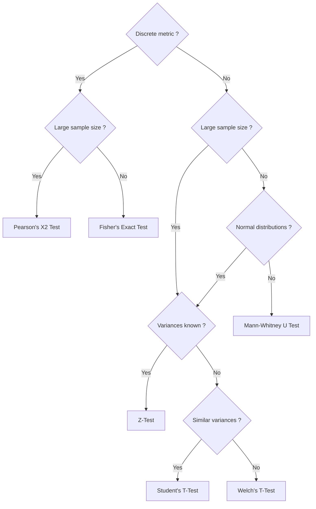

A/B testing, also known as split testing, is a statistical method used in data science to compare two versions of a product, webpage, or marketing campaign to determine which one performs better based on a specific metric. This approach allows data scientists and marketers to make data-driven decisions rather than relying on intuition or guesswork.

## A/B Testing General Procedure

1. Problem Statement
2. Hypothesis Testing
3. Design the Experiment
4. Run the Experiment
5. Validity Checks
6. Interpret the Results
7. Launch Decision

## Tips for Designing a Good Experiment

- Focus on the business goal first (user journey).
- Use the user funnel to identify the success metric.
- A success metric must be: measurable, attributable, sensitive and timely.

## Example

### Experiment Setup

A web store wants to change the product ranking recommendation system.

- Success Metric: __revenue per day per user__.
- Null Hypothesis __($Ho$)__: the average revenue per day per user between the baseline and variant ranking algorithms are the same.
- Alternative Hypothesis __($Ha$)__: the average revenue per day per user between the baseline and variant ranking algorithms are different.
- Significance Level __($\alpha = 0.05$)__: If the p-value is $< \alpha$, then reject $Ho$ and conclude $Ha$.
- Statistical Power __($power = 0.80$)__: The probability of detecting an effect if the alternative hypothesis is true.
- Minimum Detectable Effect __($MDE = 1\%$ lift)__: If the change is at least 1% higher in revenue per day per user then it is practically significant.

### Running the Experiment

1. Set the randomization unit: user
2. Target population in the experiment: visitors who searches a product
3. Determine the sample size: $n \approx \frac{16\sigma^{2}}{\delta^{2}}$, where $\sigma$ is the sample standard deviation and $\delta$ is the difference between the control and treatment (based on $\alpha=0.05$ and $power=0.80$)
4. Define the experiment duration
5. Running
    - Set up instruments and data pipelines to collect data
    - Avoid peeking p-values
6. Validity checks (search for bias)
    - Check for instrumentation effects
    - External factors
    - Selection bias
    - Sample ratio mismatch
    - Novelty effect (e.g. segment by new and old visitors)
7. Interpret the results
8. Launch decision
    - Metric trade-offs
    - Cost of launching

## Statistical Tests

### Discrete Metrics

- Fisher's Exact Test
- Pearson's Chi-Squared Test

### Continous Metrics
- Z-Test
- Student's T-Test
- Welch's T-Test
- Mann-Whitney U Test

### Choosing the Right Test



## A/B Testing Example - Simulating Click Data


```python
import pandas as pd
import numpy as np
from scipy.stats import norm
```


```python
N_experiment = 10000
N_control = 10000

alpha = 0.05

click_experiment = pd.Series(np.random.binomial(1, 0.5, size=N_experiment))
click_control = pd.Series(np.random.binomial(1, 0.42, size=N_control))
```


```python
df = pd.concat(
    [
        pd.DataFrame(
            {
                "Click": click_experiment,
                "Group Label": "Experiment",
            }
        ),
        pd.DataFrame(
            {
                "Click": click_control,
                "Group Label": "Control",
            }
        ),
    ]
).reset_index(drop=True)
df
```


<div>
<style scoped>
    .dataframe tbody tr th:only-of-type {
        vertical-align: middle;
    }

    .dataframe tbody tr th {
        vertical-align: top;
    }

    .dataframe thead th {
        text-align: right;
    }
</style>
<table border="1" class="dataframe">
  <thead>
    <tr style="text-align: right;">
      <th></th>
      <th>Click</th>
      <th>Group Label</th>
    </tr>
  </thead>
  <tbody>
    <tr>
      <th>0</th>
      <td>1</td>
      <td>Experiment</td>
    </tr>
    <tr>
      <th>1</th>
      <td>0</td>
      <td>Experiment</td>
    </tr>
    <tr>
      <th>2</th>
      <td>1</td>
      <td>Experiment</td>
    </tr>
    <tr>
      <th>3</th>
      <td>0</td>
      <td>Experiment</td>
    </tr>
    <tr>
      <th>4</th>
      <td>1</td>
      <td>Experiment</td>
    </tr>
    <tr>
      <th>...</th>
      <td>...</td>
      <td>...</td>
    </tr>
    <tr>
      <th>19995</th>
      <td>1</td>
      <td>Control</td>
    </tr>
    <tr>
      <th>19996</th>
      <td>0</td>
      <td>Control</td>
    </tr>
    <tr>
      <th>19997</th>
      <td>0</td>
      <td>Control</td>
    </tr>
    <tr>
      <th>19998</th>
      <td>0</td>
      <td>Control</td>
    </tr>
    <tr>
      <th>19999</th>
      <td>1</td>
      <td>Control</td>
    </tr>
  </tbody>
</table>
<p>20000 rows × 2 columns</p>
</div>


```python
X_experiment = df.groupby("Group Label")["Click"].sum().loc["Experiment"]
X_control = df.groupby("Group Label")["Click"].sum().loc["Control"]
print(
    f"# Clicks in 'Control' group: {X_control}\n# Clicks in 'Experiment' group: {X_experiment}"
)
```

    # Clicks in 'Control' group: 4158
    # Clicks in 'Experiment' group: 5025


```python
# calculating probabilities
p_experiment_hat = X_experiment / N_experiment
p_control_hat = X_control / N_control
print(
    f"Click probability in 'Control' group: {p_control_hat}\nClick probability in 'Experiment' group: {p_experiment_hat}"
)
```

    Click probability in 'Control' group: 0.4158
    Click probability in 'Experiment' group: 0.5025


```python
p_pooled_hat = (X_control + X_experiment) / (N_control + N_experiment)
pooled_variance = (
    p_pooled_hat * (1 - p_pooled_hat) * (1 / N_control + 1 / N_experiment)
)
```


```python
SE = np.sqrt(pooled_variance)
print(f"Standard Error: {SE}")
```

    Standard Error: 0.007047428999287613


```python
# Z-Test
test_stat = (p_control_hat - p_experiment_hat) / SE
print(test_stat)
```

    -12.302358776337297


```python
z_crit = norm.ppf(1 - alpha / 2)
print(z_crit)
```

    1.959963984540054


```python
p_val = 2 * norm.sf(abs(test_stat))
print(p_val)
```

    8.796717238230464e-35


```python
if p_val < alpha:
    print("Reject Ho !")
else:
    print("Does not reject Ho !")
```

    Reject Ho !


```python
# confidence interval
CI = [
    round((p_experiment_hat - p_control_hat) - SE * z_crit, 3),
    round((p_experiment_hat - p_control_hat) + SE * z_crit, 3),
]
CI
```


    [np.float64(0.073), np.float64(0.101)]
