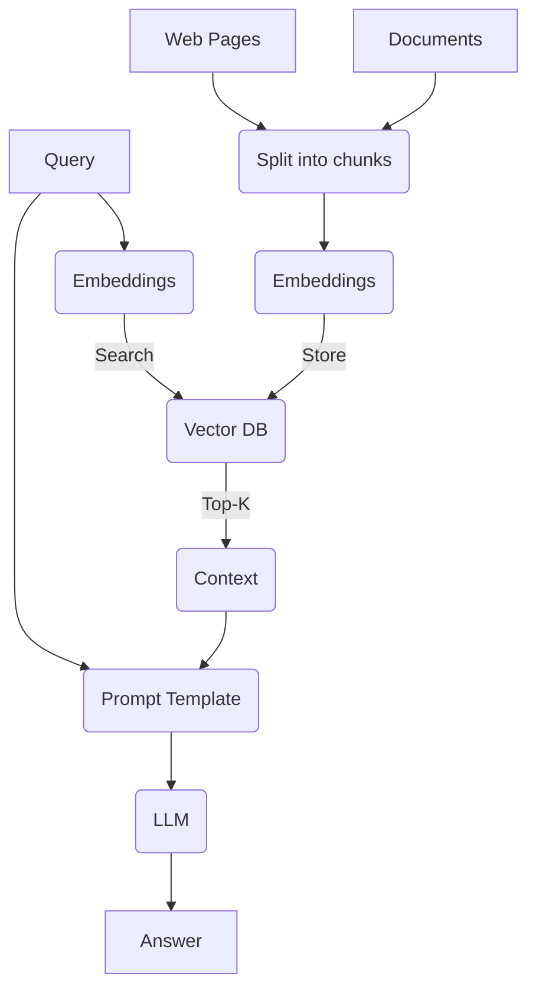

Retrieval Augmented Generation (RAG) is a way to enhance a specific context comprehension by a Large Language Model (LLM). This approach combines a database information retrieval with LLMs reasoning capabilities.

## RAG Pipeline

## Embedding Vectors

## Cosine Similarity Score

$$S_c(A, B) :=cos(\theta) = \frac{\mathbf{A}\cdot\mathbf{B}}{\|\mathbf{A}\|\cdot\|\mathbf{B}\|}$$

## Vector Databases

## Hierarchical Navigable Small Worlds (HNSW)

Trade precision for speed.

