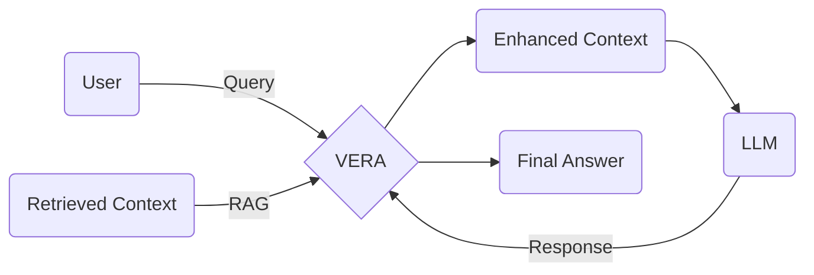

Paper: https://arxiv.org/pdf/2409.15364v1

VERA is a framework that contributes to validation and also enhancement of retrieval augmented systems powered by large language models (LLM). The method proposes a way to measure the relevance both for the retrieved information and the LLM final response.

These are the three metrics inferred from the framework:

- Retrieved context relevance
- Response relevance
- Response adherence

## VERA Framework

Similar to [[factual-correctness|Factual Correctness]] for estimate the LLM response relevance and adherence this paper uses a strategy of breakdown the complete response into smaller statements.