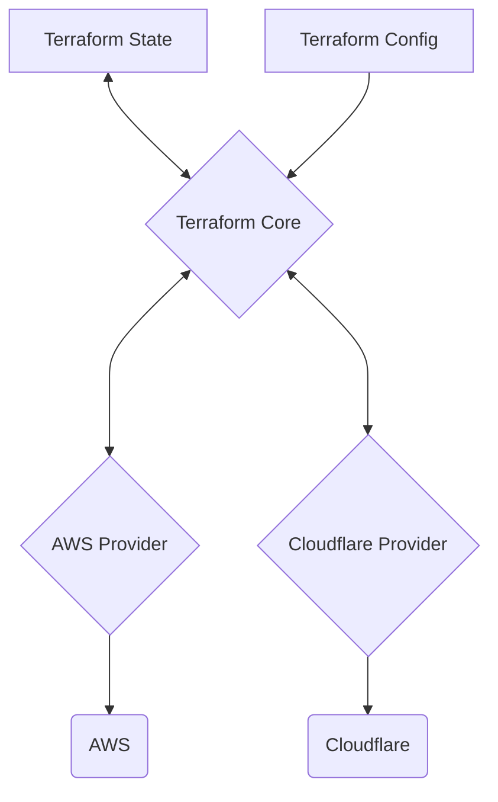

Terraform is an [[infrastructure-as-code|IaC]] tool for building, changing an versioning infrastructure safely and efficiently.

- Compatible with many clouds and services.
- Enables application software best practices to infrastructure.

Official Terraform Language Documentation: [https://developer.hashicorp.com/terraform/language](https://developer.hashicorp.com/terraform/language)

## Terraform Architecture



## Basic Usage Sequence

- `terraform init`: sets up the working directory and downloads plugins.
- `terraform fmt`: formats configuration file contents.
- `terraform validate`: checks configuration files for errors.
- `terraform plan`: shows what changes will be made.
- `terraform apply`: applies the planned changes.
- `terraform destroy`: deletes all managed resources.

## Providers Definition

```terraform
# Defines AWS provider
terraform {
  required_providers {
    aws = {
      source  = "hashicorp/aws"
      version = "~> 5.0"
    }
  }
}

# Configure the AWS Provider
provider "aws" {
  region = "us-east-1"
}
```

## Basic Terraform Usage

- **State File**: is a Terraform's world representation on a JSON file, containing information about every resource and data objects. Can contain sensitive information (e.g. database password) and can be stored locally or remotely.

```terraform
# Provide resources for remote backend management

# KMS Key
resource "aws_kms_key" "my_key" {
  description             = "This key is used to encrypt bucket objects"
  deletion_window_in_days = 10
}

# Bucket S3
resource "aws_s3_bucket" "terraform_state_s3" {
  bucket        = "my-bucket-name"
  force_destroy = true
}

# Bucket S3 Versioning
resource "aws_s3_bucket_versioning" "terraform_state_s3_versioning" {
  bucket = aws_s3_bucket.terraform_state_s3.id
  versioning_configuration {
    status = "Enabled"
  }
}

# Bucket S3 Server Side Encryption
resource "aws_s3_bucket_server_side_encryption_configuration" "terraform_state_s3_encrypt" {
  bucket = aws_s3_bucket.terraform_state_s3.id
  rule {
    apply_server_side_encryption_by_default {
      kms_master_key_id = aws_kms_key.my_key.arn
      sse_algorithm     = "aws:kms"
    }
  }
}

# DynamoDB
resource "aws_dynamodb_table" "terraform_locks" {
  name         = "terraform-state-locks"
  billing_mode = "PAY_PER_REQUEST"
  hash_key     = "LockID"
  attribute {
    name = "LockID"
    type = "S"
  }
}
```

```terraform
# Defines a remote backend
terraform {
  backend "s3" {
    bucket         = "my-bucket-name"
    key            = "tf-infra/terraform.tfstate"
    region         = "us-east-1"
    dynamodb_table = "terraform-state-locks"
    encrypt        = true
  }
  # Defines AWS provider
  required_providers {
    aws = {
      source  = "hashicorp/aws"
      version = "~> 5.0"
    }
  }
}

# Configure the AWS Provider
provider "aws" {
  region = "us-east-1"
}
```

### Resource Block vs Data Block

- **Resource Block**: is used when you want Terraform to manage (create, update, destroy) infrastructure.
- **Data Block**: is used when you need to reference or query information about existing resources or external data sources, without managing their lifecycle.

### Variable Types

- **Primitive Types:**
	- number
	- string
	- bool

- **Complex Types**:
	- list()
	- set()
	- map()
	- object({ = , ... })
	- tuple([, ...])

- **Input Variables**: arguments of a function. `var.<variable_name>`

```terraform
variable "instance_type" {
  description = "EC2 instance type"
  type        = string
  default.    = "t2.micro"
}
```

- **Local Variables**: inside function temporary local variables. `local.<variable_name>`

```terraform
locals {
  service_name = "My App"
  owner        = "Lucas"
}
```

- **Output Variables**: returned value of a function.

```terraform
output "resource_arn" {
  value = aws_s3_bucket.terraform_state_s3.arn
}
```

> [!NOTE]
> **Setting Input Variables by Precedence Order**
> - Manual entry during plan/apply
> - Default value in declaration block
> - `TF_VAR_<name>` environment variables
> - `terraform.tfvars` file
> - `*.auto.tfvars` file
> - Command line `-var` or `-var-file`

Applying a different variable file: `terraform apply -var-file=<FILE_NAME>.tfvars`

Passing variables via CLI: `terraform apply -var="<VAR_NAME>=<VAR_VALUE>" -var="<VAR_NAME>=<VAR_VALUE>"`

When working with sensitive  data, enable sensitive flag `sensitive = true` and passes the value by environment variable or secret manager (`-var`).

### Additional Language Features

#### Expressions

```terraform
# STRINGS
"some text" # literal string
"some text ${var.my_variable}" # template string

# OPERATORS
+, -, *, /, % # arithmetic
==, != # equality
<, >, <=, >= # comparison
&&, || # logical

# CONDITIONALS
condition ? true_val : false_val
var.my_variable != "" ? var.my_variable : "default_var_value" # example

# FOR
output "upper_envs" {
  value = [for env in var.envs : upper(env)]
}
```

#### Functions

```terraform
# NUMERIC
abs()
ceil()
floor()
log()
max()
parseint()
pow()
signum()

# STRING
chomp() # remove newlines at end
format() # format number
formatlist()
indent()
join()
lower()
regex()
regexall()
replace()
split()
strrev() # reverse string
substr()
title()
trim()
trimprefix()
trimsuffix()
trimspace()
upper()

# OTHER FUNCTION TYPES:

# - Colleciton
# - Encoding
# - Filesystem
# - Date & Time
# - Hash & Crypto
# - IP Network
# - Type Conversion
```

#### Meta-Arguments

Special arguments to control the behavior of resources and/or modules.

- `depends_on`: Explicitly declares resource dependencies.
- `count`: Creates multiple resource instances based on a number.
- `for_each`: Creates resources for each item in a map or set.
- `lifecycle`: Configures resource behavior for create, update, and delete actions.
- `ignore_changes`: Prevents updates if specified attributes change outside Terraform.
- `prevent_destroy`: Blocks resource deletion unless this protection is removed.

```terraform
# FOR_EACH EXAMPLE
# creating three copies of example_resource with names 'a', 'b' and 'c'
resource "example_resource" "example" {
  for_each = toset( ["a", "b", "c"] )
  name     = each.key
}

# LIFECYCLE EXAMPLE
resource "example_resource" "example" {
  # ...
  lifecycle {
    create_before_destroy = true # indicates that if the resource does need to be destroyed, Terraform should first provision its replacement before destroying the deprecated resource
  }
}
```

## Modules and Project Organization

A good module raises the abstraction level from base resource types, grouping it in a logical way and providing useful defaults. Also the module must enable input variables exposition for proper customization and return adequate outputs to make further integrations possible.

- **Root Module**: default module containing all `.tf` files in main working directory.
- **Child Module**: a separate external module referred from a `.tf` file.

- **Module Sources**:
	- Local paths
	- S3 buckets
	- Terraform registry
	- GitHub
	- and more ...

```terraform
# LOCAL PATH SOURCE
module "my-example-module" {
  source = "../my-example-module"

  # input variables
  bucket_name   = "my-bucket-s3"
  instance_name = "t2.micro"
  kms_id        = var.kms_identifier
  ...
}

# GITHUB SOURCE
module "my-example-module" {
  source = "github.com/hashicorp/example?ref=v1.2.0"
}
```

## Managing Multiple Environments

There is two main approaches:

1. **Workspaces**: multiple named sections within a single backend.
2. **File Structure**: directory layout provides separation.

Example using file structure:

```bash
infra/
├── main.tf           # Global configuration used by all environments
├── variables.tf      # Variable definitions
├── outputs.tf        # Output definitions
├── provider.tf       # Provider configuration (can be global or parameterized)
├── modules/          # Reusable modules (optional)
├── environments/
│   ├── dev.tfvars    # Variables for dev environment
│   ├── stage.tfvars  # Variables for staging environment
│   └── prod.tfvars   # Variables for prod environment
└── backend.tf        # Backend configuration for remote state (optional)
```

- **Using AWS Multi-Account**: [https://www.hashicorp.com/en/resources/going-multi-account-with-terraform-on-aws](https://www.hashicorp.com/en/resources/going-multi-account-with-terraform-on-aws)

## Testing Terraform Code

- Static checks (e.g. custom validation rules)
- Manual testing
- Automated testing

## Developer Workflow

Usually the Terraform workflow is automated by a [[ci-cd|CI/CD]] pipeline. 

1. Write/update code
2. Run changes locally (for development environment)
3. Create a pull request
4. Run tests via Continuous Integration
5. Deploy to homolog environment via Continuous Deployment (on merge to main)
6. Deploy to production environment via Continuous Deployment (on release)

## Additional Tools

- **Terragrunt**: minimizes code repetition and enables multi-account separation.
- **Cloud Nuke**: easy cleanup of cloud resources.
- **Makefile**: prevents human errors.

---

- Add templating example #pending