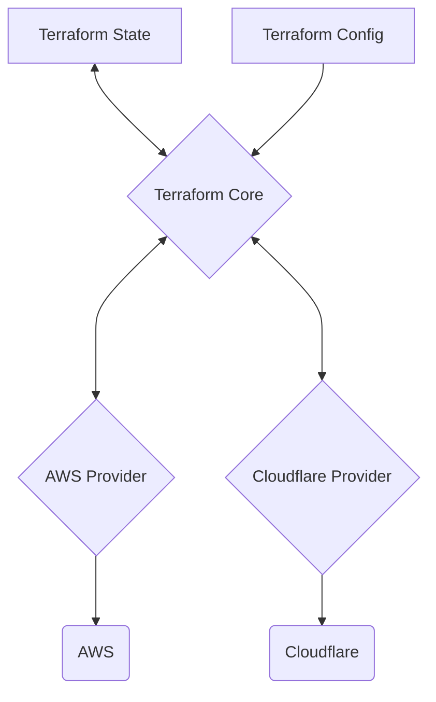

Terraform is an [[infrastructure-as-code|IaC]] tool for building, changing an versioning infrastructure safely and efficiently.

- Compatible with many clouds and services.
- Enables application software best practices to infrastructure.

## Terraform Architecture



## Basic Usage Sequence

- `terraform init`: sets up the working directory and downloads plugins.
- `terraform fmt`: formats configuration file contents.
- `terraform validate`: checks configuration files for errors.
- `terraform plan`: shows what changes will be made.
- `terraform apply`: applies the planned changes.
- `terraform destroy`: deletes all managed resources.

## Providers Definition

```terraform
# Defines AWS provider
terraform {
  required_providers {
    aws = {
      source  = "hashicorp/aws"
      version = "~> 5.0"
    }
  }
}

# Configure the AWS Provider
provider "aws" {
  region = "us-east-1"
}
```