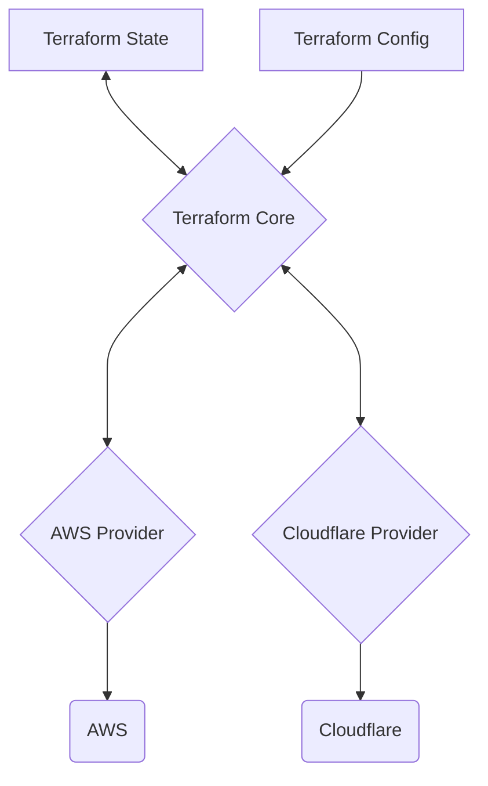

Terraform is an [[infrastructure-as-code|IaC]] tool for building, changing an versioning infrastructure safely and efficiently.

- Compatible with many clouds and services.
- Enables application software best practices to infrastructure.

## Terraform Architecture



## Basic Usage Sequence

- `terraform init`: sets up the working directory and downloads plugins.
- `terraform fmt`: formats configuration file contents.
- `terraform validate`: checks configuration files for errors.
- `terraform plan`: shows what changes will be made.
- `terraform apply`: applies the planned changes.
- `terraform destroy`: deletes all managed resources.

## Providers Definition

```terraform
# Defines AWS provider
terraform {
  required_providers {
    aws = {
      source  = "hashicorp/aws"
      version = "~> 5.0"
    }
  }
}

# Configure the AWS Provider
provider "aws" {
  region = "us-east-1"
}
```

## Basic Terraform Usage

- **State File**: is a Terraform's world representation on a JSON file, containing information about every resource and data objects. Can contain sensitive information (e.g. database password) and can be stored locally or remotely.

```terraform
# Provide resources for remote backend management

# KMS Key
resource "aws_kms_key" "my_key" {
  description             = "This key is used to encrypt bucket objects"
  deletion_window_in_days = 10
}

# Bucket S3
resource "aws_s3_bucket" "terraform_state_s3" {
  bucket        = "my-bucket-name"
  force_destroy = true
}

# Bucket S3 Versioning
resource "aws_s3_bucket_versioning" "terraform_state_s3_versioning" {
  bucket = aws_s3_bucket.terraform_state_s3.id
  versioning_configuration {
    status = "Enabled"
  }
}

# Bucket S3 Server Side Encryption
resource "aws_s3_bucket_server_side_encryption_configuration" "terraform_state_s3_encrypt" {
  bucket = aws_s3_bucket.terraform_state_s3.id
  rule {
    apply_server_side_encryption_by_default {
      kms_master_key_id = aws_kms_key.my_key.arn
      sse_algorithm     = "aws:kms"
    }
  }
}

# DynamoDB
resource "aws_dynamodb_table" "terraform_locks" {
  name         = "terraform-state-locks"
  billing_mode = "PAY_PER_REQUEST"
  hash_key     = "LockID"
  attribute {
    name = "LockID"
    type = "S"
  }
}
```

```terraform
# Defines a remote backend
terraform {
  backend "s3" {
    bucket         = "my-bucket-name"
    key            = "tf-infra/terraform.tfstate"
    region         = "us-east-1"
    dynamodb_table = "terraform-state-locks"
    encrypt        = true
  }
  # Defines AWS provider
  required_providers {
    aws = {
      source  = "hashicorp/aws"
      version = "~> 5.0"
    }
  }
}

# Configure the AWS Provider
provider "aws" {
  region = "us-east-1"
}
```