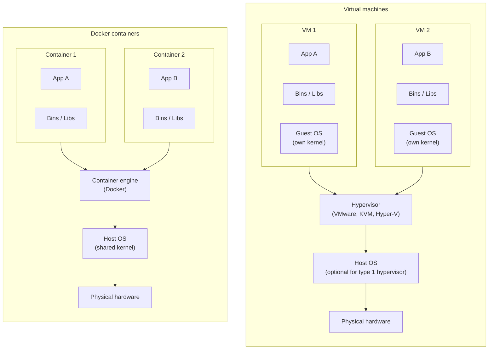

## Fundamentals

Container are independent and isolated environments that have yours:

- Own processes
- Own network
- Own mounts
- Shares the same OS kernel

> [!info]
> A container only lives as long as the process inside it is alive.

### Containers vs virtual machines

Containers runs on top of a container engine (like Docker) and leverages the host OS kernel. Whereas VMs runs on top hypervisors that virtualize physical hardware resources like CPU, RAM and storage.

The resource usage is much more low on containers when compared to VMs, this is because every VM instance need to includes a fully operating system.

Additionally, containers have a faster boot up speed.



## Basic commands

### Build stage

| Command                          | Description                                                                        |
| -------------------------------- | ---------------------------------------------------------------------------------- |
| `docker build -t <IMAGE_NAME> .` | Builds an image from the Dockerfile in the current directory, naming it with `-t`. |
| `docker images`                  | Lists all local images.                                                            |
| `docker history <IMAGE_NAME>`    | Shows the image layers and the size added by each Dockerfile instruction.          |
| `docker rmi <IMAGE_NAME>`        | Deletes a local image (no container can be using it).                              |

### Ship stage

| Command                                                 | Description                                                             |
| ------------------------------------------------------- | ----------------------------------------------------------------------- |
| `docker pull <IMAGE_NAME>`                              | Downloads an image from the registry without running it.                |
| `docker login [<REGISTRY>]`                             | Authenticates to a registry (defaults to Docker Hub).                   |
| `docker tag <IMAGE_NAME> <REGISTRY>/<IMAGE_NAME>:<TAG>` | Creates a new tag (alias) for an image, usually pointing to a registry. |
| `docker push <REGISTRY>/<IMAGE_NAME>:<TAG>`             | Uploads an image to the registry.                                       |

### Run stage

| Command                                                                        | Description                                                                                         |
| ------------------------------------------------------------------------------ | --------------------------------------------------------------------------------------------------- |
| `docker run <IMAGE_NAME>`                                                      | Creates and starts a container from an image (pulls the image first if it isn't available locally). |
| `docker run redis:7.4`                                                         | Runs a specific image version by using a tag (defaults to `latest` when omitted).                   |
| `docker run -d <IMAGE_NAME>`                                                   | Runs the container in detached mode (in the background).                                            |
| `docker run -it <IMAGE_NAME>`                                                  | Runs the container in interactive mode (`-i`) attached to a pseudo-terminal (`-t`).                 |
| `docker run -p 80:5000 <IMAGE_NAME>`                                           | Maps the host port 80 to the container port 5000.                                                   |
| `docker run -v /opt/datadir:/var/lib/mysql mysql`                              | Mounts the host directory into the container, so the data persists after the container is removed.  |
| `docker run --mount type=bind,source=/opt/datadir,target=/var/lib/mysql mysql` | Same bind mount as above, using the newer and more explicit `--mount` syntax.                       |
| `docker ps [-a]`                                                               | Lists all running containers (`-a` includes the stopped ones).                                      |
| `docker logs <CONTAINER_ID>`                                                   | Shows the container's output logs (useful for detached containers).                                 |
| `docker exec <CONTAINER_ID> <COMMAND>`                                         | Executes a command inside a running container.                                                      |
| `docker attach <CONTAINER_ID>`                                                 | Re-attaches the terminal to a detached running container.                                           |
| `docker inspect <CONTAINER_ID>`                                                | Shows the container's detailed configuration and state in JSON format.                              |
| `docker stop <CONTAINER_NAME>`                                                 | Stops a running container.                                                                          |
| `docker rm <CONTAINER_NAME>`                                                   | Deletes a stopped container.                                                                        |
| `docker system prune`                                                          | Removes all stopped containers, unused networks, dangling images and build cache.                   |

## Docker compose commands

| Command                                       | Description                                                                                    |
| --------------------------------------------- | ---------------------------------------------------------------------------------------------- |
| `docker compose up`                           | Creates and starts all services defined in the `docker-compose.yaml` file.                     |
| `docker compose up -d`                        | Starts all services in detached mode (in the background).                                      |
| `docker compose up --build`                   | Rebuilds the services' images before starting them.                                            |
| `docker compose down [-v]`                    | Stops and removes the services' containers and networks (`-v` also removes the volumes).       |
| `docker compose ps`                           | Lists the containers of the current compose project.                                           |
| `docker compose logs [-f] [<SERVICE>]`        | Shows the services' logs (`-f` follows the output).                                            |
| `docker compose build [<SERVICE>]`            | Builds or rebuilds the services' images.                                                       |
| `docker compose pull`                         | Downloads the latest version of the services' images.                                          |
| `docker compose exec <SERVICE> <COMMAND>`     | Executes a command inside a running service container.                                         |
| `docker compose run --rm <SERVICE> <COMMAND>` | Runs a one-off command in a new service container (`--rm` removes it afterwards).              |
| `docker compose stop`                         | Stops the running services without removing them.                                              |
| `docker compose restart [<SERVICE>]`          | Restarts the services.                                                                         |
| `docker compose config`                       | Validates and prints the resolved configuration (with the environment variables interpolated). |

## Images

How to create your own image? The answer is: using a `Dockerfile`.

Initial Docker problems with the legacy builder before the BuildKit engine:

1. Packages re-download at each build
2. Architecture lock-in

```shell
docker buildx build --platform linux/amd64,linux/arm64 -t myapp --push .
```

3. Secrets leak
4. Sequential stages

```Dockerfile
FROM python:3.13-slim-trixie

WORKDIR /app

COPY requirements.txt .

# S1. cache mount solution
RUN --mount=type=cache,target=/root/.cache/pip \
	pip install -r requirements.txt

# S3. secret mount
RUN --mount=type=secret,id=mykey \
	curl -H "Authorization: Bearer $(cat /run/secrets/mykey)" \
	https://api.example.com/private

COPY app.py /app/

ENV FLASK_APP=/app/app.py

ENTRYPOINT ["python", "/app/app.py"]
```

Build command:

```bash
docker build --secret id=mykey,src=./key.txt -t myapp .
```

## Docker init

It's a template scaffolder for starting a new Dockerfile setup.

## Command vs entrypoint

`ENTRYPOINT` defines the fixed executable that **must** run while `CMD` provides default arguments that are easily overridden by the use at runtime.

```Dockerfile
FROM ubuntu
ENTRYPOINT ["ping"]
CMD ["google.com"]
```

## Docker compose

Used to orchestrate applications with multiple containers.

```yaml
# Simple stack: a Python API (built locally) + a Postgres database (from a registry).
#
#   docker compose up -d --build   # build and start everything
#   docker compose down            # stop (data is kept in the volume)
#   docker compose down -v         # stop and delete the data volume
#
# ${VAR:-default} placeholders are read from your shell or from a .env file
# next to this file; the value after ":-" is used when VAR is not set.

services:
  api:
    # Build the image locally from ./app/Dockerfile
    build:
      context: ./app
      dockerfile: Dockerfile
    # Map host port -> container port
    ports:
      - "${API_PORT:-8000}:8000"
    # Environment variables available inside the container.
    # "db" is the service name below, resolved by Docker's internal DNS.
    environment:
      DATABASE_URL: postgresql://${POSTGRES_USER:-postgres}:${POSTGRES_PASSWORD:-postgres}@db:5432/${POSTGRES_DB:-app}
    # Start only after the database passes its healthcheck
    depends_on:
      db:
        condition: service_healthy
    networks:
      - backend

  db:
    # Pull a ready-made image from Docker Hub
    image: postgres:17-alpine
    environment:
      POSTGRES_USER: ${POSTGRES_USER:-postgres}
      POSTGRES_PASSWORD: ${POSTGRES_PASSWORD:-postgres}
      POSTGRES_DB: ${POSTGRES_DB:-app}
    # Optional: expose Postgres to the host (e.g. for a local SQL client)
    ports:
      - "${DB_PORT:-5432}:5432"
    # Named volume: keeps the data when the container is recreated
    volumes:
      - db_data:/var/lib/postgresql/data
    # Used by depends_on above to know when the database is ready
    healthcheck:
      test: ["CMD-SHELL", "pg_isready -U $${POSTGRES_USER} -d $${POSTGRES_DB}"]
      interval: 5s
      timeout: 3s
      retries: 10
    networks:
      - backend

# Custom network shared by both services
networks:
  backend:
    driver: bridge

# Named volumes managed by Docker
volumes:
  db_data:
```

## Docker registry, storage and networking

### Registry options

- Local host
- Local private registry
- Remote private registry

### Storage

Docker can mount volumes to persist data across multiple containers.

- Volume mount
- Bind mount

### Network

- Bridge (default)
- None
- Host

## Container orchestration

Most common tools for that are:

- Docker Swarm
- Kubernetes
