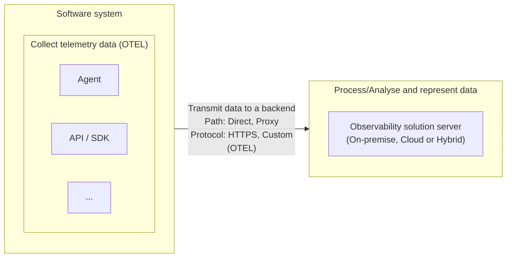

## Observability fundamentals

Observability is the process of understand the internal state of a system using output measurements. It improves these non-functional system requirements:

- Availability
- Reliability
- Performance

These three together gives us the software system **stability**.

### Monitoring versus observability

Different from monitoring, observability helps identify underlying cause of a failure or incident.

### Telemetry signals

- **Metrics**: numerical values as point in time
- **Logs**: records of activities or events
- **Traces**: shows the path and request states through a system
- **Baggage**: ???
- **Profiles**: ???

### Reliability metrics

All metrics below are improved by an observability system, but the monitoring system only improves the **MTTD**.

- Mean time to detect (MTTD) - improved by monitoring and observability.
- Mean time to repair (MTTR)
- Mean time between failures (MTBF)
- Mean time to failure (MTTF)

### General structure of observability solutions

## Instrumentation process

- **Zero-code**: adds API & SDK capabilities as agent or agent-like installation
  - _OpenTelemetry eBPF Instrumentation_: instrumentation on kernel level (only for linux)
- **Code-based**: manual instrumentation
- **Libraries**: between zero-code and code-based
