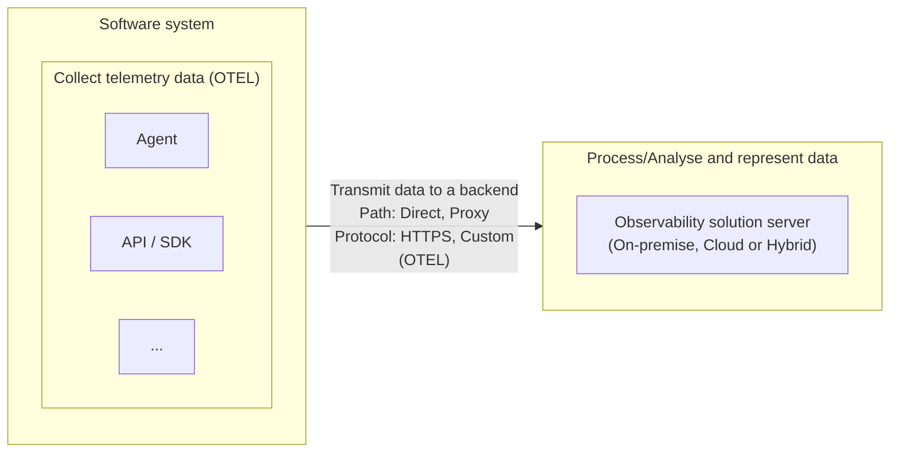

## Observability fundamentals

Observability is the process of understand the internal state of a system using output measurements. It improves these non-functional system requirements:

- Availability
- Reliability
- Performance

These three together gives us the software system **stability**.

### Monitoring versus observability

Different from monitoring, observability helps identify underlying cause of a failure or incident.

### Telemetry signals

- **Metrics**: numerical values as point in time
- **Logs**: records of activities or events
- **Traces**: shows the path and request states through a system
- **Baggage**: ???
- **Profiles**: it's an emerging signal ...

### Reliability metrics

All metrics below are improved by an observability system, but the monitoring system only improves the **MTTD**.

- Mean time to detect (MTTD) - improved by monitoring and observability.
- Mean time to repair (MTTR)
- Mean time between failures (MTBF)
- Mean time to failure (MTTF)

### General structure of observability solutions

## Instrumentation process

- **Zero-code**: adds API & SDK capabilities as agent or agent-like installation
  - _OpenTelemetry eBPF Instrumentation_: instrumentation on kernel level (only for linux)
- **Code-based**: manual instrumentation
- **Libraries**: between zero-code and code-based

## Code-based instrumentation

### Metrics

1. Initialize a meter provider on top of application
2. Meter creates metric instruments which captures measurements
3. Metric exporter sends metrics to a consumer

Every metric instrument is defined by 4 fields:

- Name
- Kind
  - Counter
  - Asynchronous counter
  - UpDownCounter
  - Asynchronous UpDownCounter
  - Gauge
  - Histogram
- Unit (optional)
- Description (optional)

### Traces

1. Initialize a tracer provider on top of application
2. Create a Tracer component
3. The Tracer generates spans
4. Trace exporter sends spans to a consumer

Every span has some properties:

- Name
- Span context
  - Trace ID
  - Span ID
  - Trace flags (sampled?)
  - Trace state (custom vendor data)
- Parent span ID
- Start and end timestamps
- Attributes
  - Key-value pair with custom information
- Span events
  - Structured log message
- Span links
- Span status
  - unset (default - success)
  - error
  - ok (user defined success)
- Span kind
  - client
  - server
  - internal
  - producer
  - consumer

Trace context propagation: is what keeps multiples spans together

- Default propagator (W3C trace context)
  - traceparent
  - tracestate

### Logs

- OpenTelemetry supports existing legacy of logs and logging libraries + enhance
- Does not provide bespoke API or SDK to create logs
- Enhances existing logs with correlation data (trace id, span id etc.)
- Provides capabilities to receive, process and export log data to a consumer/backend server

- Timestamp
- ObservedTimestamp
- TraceId
- SpanId
- TraceFlags
- SeverityText (log level)
- SeverityNumber
- Body
- Resource
- InstrumentationScope
- Attributes

### Baggage

- key-value store
- used to pass contextual information between different services
- contextual information that is passed between signals

### Profilling

- snapshots of code resource utilizations (CPU / Memory)
- Application-level profilling
- System-level profiling
- opentelemetry-ebpf-profiler
-

## Zero-code + code-base instrumentation together

pass

## SDK Architecture and Composability

The SDK it's the engine provides the `resource` and `exporters` elements.

The sdk has three main elemnts

- Meeter Provider
- Tracer Provider
- Logger Provider

Each module has your own plugins interfaces.

API -> Provider -> Processor/Reader -> Exporter

Three ways of configure the SDK

- Programmatic configuration
- environment variables
- configuration files

==DIAGRAM

Genretate and collect

WHAT: Metrics, Logs, Traces
How: Zero-code, Code-based
OTel: APIs, SDKs

Export

TLP
Collector
Tools
