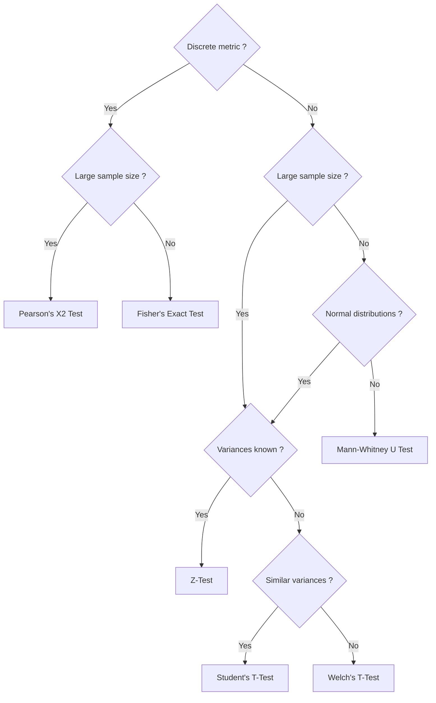

```mermaid
flowchart TD

A{Discrete metric ?} -->|Yes| B{Large sample size ?}
B -->|Yes| C[Pearson's X2 Test]
B -->|No| D[Fisher's Exact Test]
A -->|No| E{Large sample size ?}
E -->|Yes| F{Variances known ?}
E -->|No| G{Normal distributions ?}
G -->|No| H[Mann-Whitney U Test]
G -->|Yes| F
F -->|Yes| J[Z-Test]
F -->|No| K{Similar variances ?}
K -->|Yes| L[Student's T-Test]
K -->|No| M[Welch's T-Test]
```
