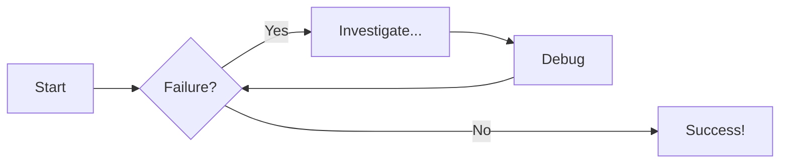

# Mkdocs Material

### Code blocks

```py
# Function to add two numbers
def add_two_numbers(num1, num2):
    return num1 + num2

# Example usage
result = add_two_numbers(5, 3)
print('The sum is:', result)
```

### Code blocks with title

```py title="add_numbers.py"
# Function to add two numbers
def add_two_numbers(num1, num2):
    return num1 + num2

# Example usage
result = add_two_numbers(5, 3)
print('The sum is:', result)
```

### Code blocks with line numbers

```py title="add_numbers.py" linenums="1"
# Function to add two numbers
def add_two_numbers(num1, num2):
    return num1 + num2

# Example usage
result = add_two_numbers(5, 3)
print('The sum is:', result)
```
You can also start the line numbers from a different number e.g. `linenums="5"`.

### Code blocks with highlight lines

```py title="add_numbers.py" linenums="1" hl_lines="2-3"
# Function to add two numbers
def add_two_numbers(num1, num2):
    return num1 + num2

# Example usage
result = add_two_numbers(5, 3)
print('The sum is:', result)
```

### Content tabs

=== "Python"

    ```py
    def main():
        print("Hello world!")

    if __name__ == "__main__":
        main()
    ```

=== "JavaScript"

    ```js
    function main() {
        console.log("Hello world!");
    }

    main();
    ```

### Admonitions

!!! note "Title of the admonition"

    Corpus text.

 For more options check the [admonitions documentation.](https://squidfunk.github.io/mkdocs-material/reference/admonitions/#supported-types)

### Diagrams


